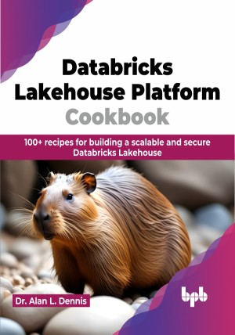

# Databricks Lakehouse Platform Cookbook

Analyze, Architect, and Innovate with Databricks Lakehouse

This is the repository for [Databricks Lakehouse Platform Cookbook
](https://bpbonline.com/products/databricks-lakehouse-platform-cookbook-1?variant=43077590188232),published by BPB Publications.

## About the Book
The Databricks Lakehouse is groundbreaking technology that simplifies data storage, processing, and analysis. This cookbook offers a clear and practical guide to building and optimizing your Lakehouse to make data-driven decisions and drive impactful results.

This definitive guide walks you through the entire Lakehouse journey, from setting up your environment, and connecting to storage, to creating Delta tables, building data models, and ingesting and transforming data. We start off by discussing how to ingest data to Bronze, then refine it to produce Silver. Next, we discuss how to create Gold tables and various data modeling techniques often performed in the Gold layer. You will learn how to leverage Spark SQL and PySpark for efficient data manipulation, apply Delta Live Tables for real-time data processing, and implement Machine Learning and Data Science workflows with MLflow, Feature Store, and AutoML. The book also delves into advanced topics like graph analysis, data governance, and visualization, equipping you with the necessary knowledge to solve complex data challenges.

By the end of this cookbook, you will be a confident Lakehouse expert, capable of designing, building, and managing robust data-driven solutions.

## What You Will Learn
• Design and build a robust Databricks Lakehouse environment.

• Create and manage Delta tables with advanced transformations.

•  Analyze and transform data using SQL and Python.

•  Build and deploy machine learning models for actionable insights.

•  Implement best practices for data governance and security.
